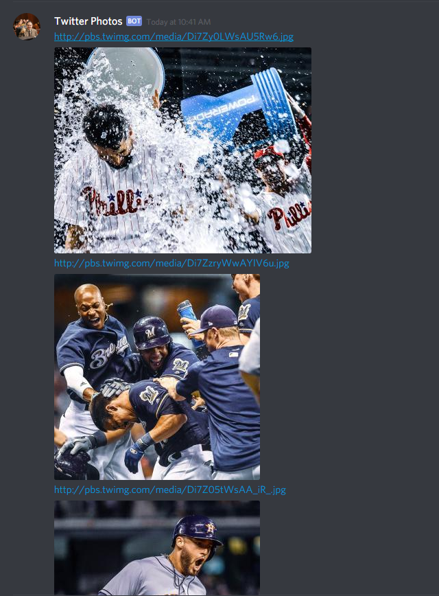

# twitter-photos-bot

## About
Tweet embeds in Discord will only preview the first photo in a embed. Furthermore, Discord is not descript when a Tweet has multiple media objects, and you must verbally tell other users that the tweet is a photo album. Thus, they have to click on the link if they want to go view the entire album. 
  
Twitter Photos bot will help embed photo albums in Discord so that users don't have to leave in order to view a tweet's photos.

## Usage
!tweet (Tweet URL) 
  
Example:
 

## Invite
https://discordapp.com/oauth2/authorize?&client_id=470978549151694848&scope=bot&permissions=8

